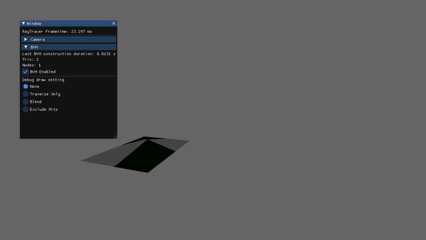
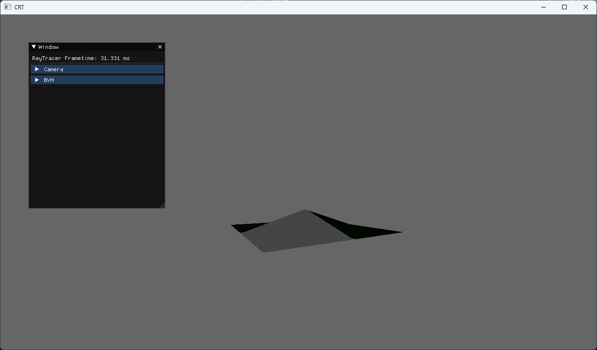
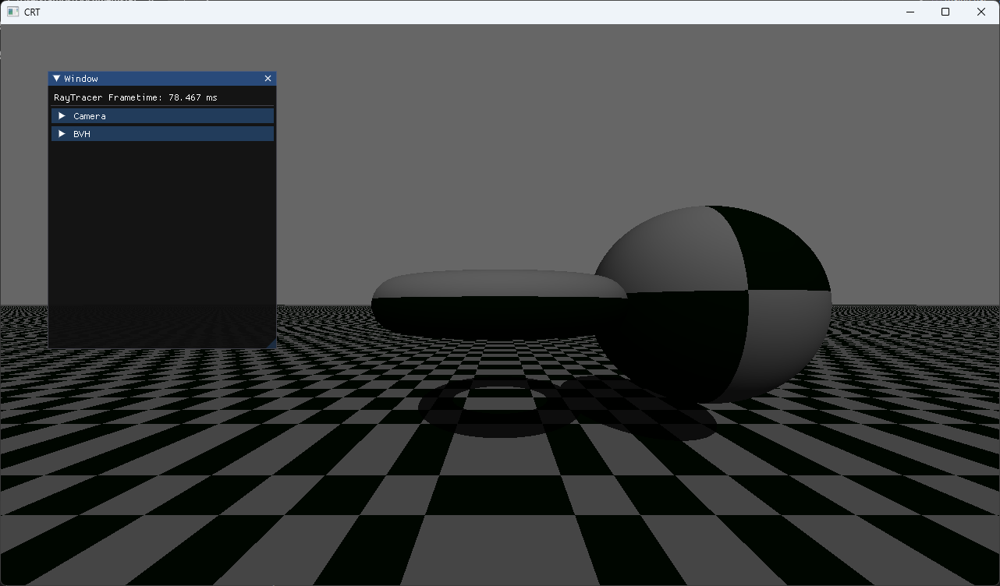
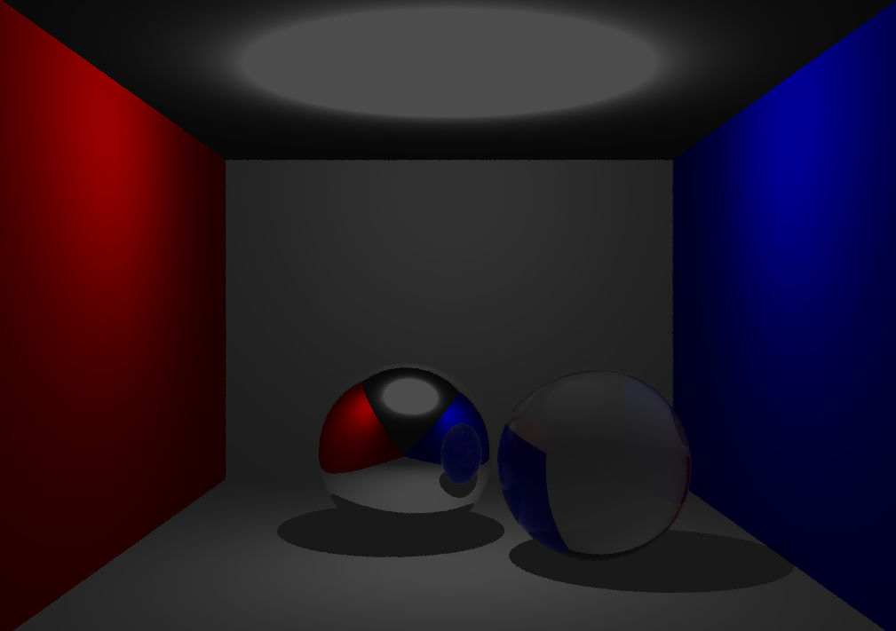
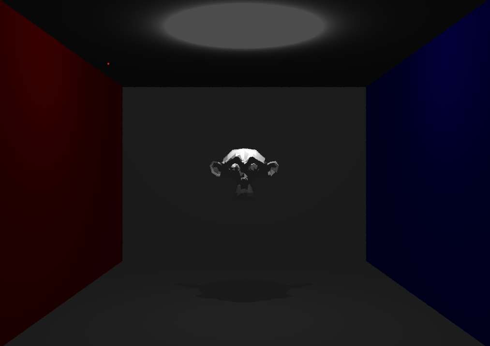
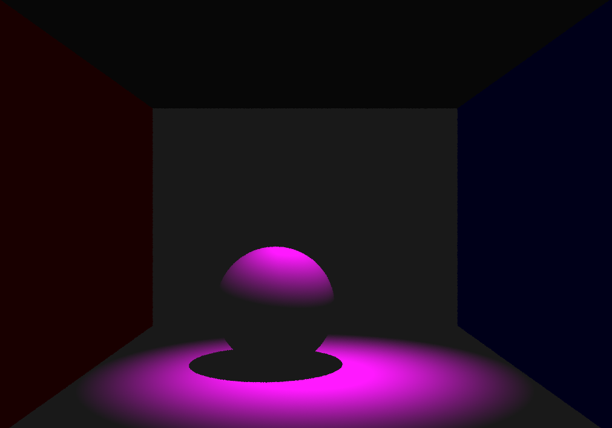

# CRT

This is a CPU Raytracer written as part of the Advanced Graphics course, taught by Jacco Bikker at Utrecht Unversity.

This is a multi-threaded, CPU-based ray-tracer that can run in real-time.

Notable features

- Reflective/refractive materials, with absorption factor through Beer's law.
- Point, directional and spotlights
- Mesh loading through assimp.
- Dynamic BVH debuggin interface through Egui.
- High-speed BVH building based on the [paper by Wald](https://www.sci.utah.edu/~wald/Publications/2007/ParallelBVHBuild/fastbuild.pdf).
- Triangle displacement mapping in raytracing, based on [the paper by Smits et al.](https://www.sci.utah.edu/~wald/Publications/2007/ParallelBVHBuild/fastbuild.pdf), though not fully operational

## BVH Debugging
As one of the primary goals of this project is proper and fast BVH construction, we added some options for visualizing the BVH hits in several ways:

- Traverse Only: Only show the visualization of traversing the BVH.
- Blend: Still show the triangle hits, evaluating material results.
- Exclude Hits: Do not blend the debug visualization colors when a triangle is hit.

## Showcase

### Displacement mapping

### Primitives

## Materials

## Model Loading

## Lighting
